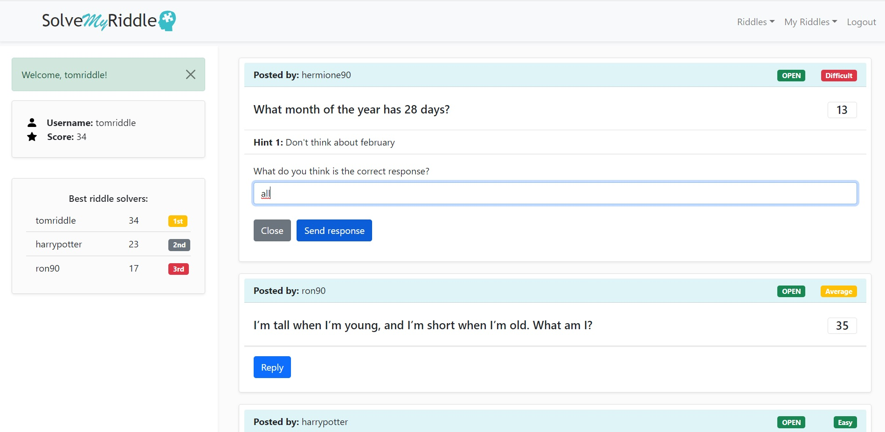

# Exam #2: "SOLVE MY RIDDLE"
## Student: s297404 CAMPAGNOLA MATTIA 

## React Client Application Routes

- Route `/`: the list of opened riddles is shown, a logged-in user has the possibility to reply.

- Route `/open`: same as `/`.

- Route `/closed`: the list of closed riddles is shown, including hints and correct response (only for logged in users). A logged in user has the possibility to see the responses associated to a closed riddle.

- Route `/myopen`: the list of <i>my</i> opened riddles is shown (only for logged in users). The user has the possibility of reading the incoming responses in real-time.

- Route `/myclosed`: the list of <i>my</i> closed riddles is shown (only for logged in users). The user has the possibility to see the responses associated to his closed riddle. 

- Route `/reply/:riddleId`: the riddle to be answered and a textual input is shown. 
  - The param `riddleId` is the id of the riddle the user wants to answer.

- Route `/:modality/responses/:riddleId`: according to the application category, the list of responses associated to a riddle is shown (only for logged in users). 
  - The param `modality` represents the specific application category (closed, myopen, myclosed).
  - The param `riddleId` is the id of the riddle the user wants to read the responses.

- Route `*`: a "Page Not Found" message is shown.

## API Server

<b> Note 1: </b> the majority of the API require a user authentication to be called  
<b> Note 2: </b> the param user id is always deserialized from the proper session content (req.user.id)

- POST `/api/sessions`
  - request body content: json credentials e.g. `{"username": "mariorossi", "password": "password"}`
  - response body content: user json object (deserialized from session storage) e.g. `{"id": 1, "username": "mariorossi", "score": 25}` and cookie to be stored by the browser
  
- GET `/api/sessions/current`
  - request header content: session cookies
  - response body content: user json object (deserialized from session storage) e.g. `{"id": 1, "username": "mariorossi", "score": 25}` or error json object
  
- DELETE `/api/sessions/current`
  - request header content: session cookies
  - response body content: none
  
- GET `/api/riddles/open`
  - request parameters: user id
  - response body content: array of riddle objects (status: open, correctResponse excluded) or error json object

  e.g 

      [
        {
          "id": 1,
          "status": "OPEN",
          "duration": 60,
          "residualTime": 45,
          "difficulty": "Average",
          "question": "What's the difference between ... ?",
          "hint1": "Try to think about...",
          "hint2": "It is not about...",
          "userId": 1,
          "userUsername": "mariorossi"
        },
        { ... },
      ]  
  
- GET `/api/riddles/closed`
  - request parameters: none
  - response body content: array of riddle objects (status: closed, correctResponse included) or error json object

  e.g 

      [
        {
          "id": 2,
          "status": "CLOSED",
          "duration": 60,
          "residualTime": 0,
          "difficulty": "Easy",
          "question": "What's the difference between ... ?",
          "hint1": "Try to think about...",
          "hint2": "It is not about...",
          "correctResponse": "It's ..." 
          "userId": 1,
          "userUsername": "mariorossi"
        },
        { ... },
      ]  

- GET `/api/riddles/myopen`
  - request parameters: user id
  - response body content: array of riddle json objects (status: open, userid: my user id, userUsername excluded, correctResponse included), or error json object.

  e.g 

      [
        {
          "id": 1,
          "status": "OPEN",
          "duration": 60,
          "residualTime": 45,
          "difficulty": "Average",
          "question": "What's the difference between ... ?",
          "correctResponse": "It's ..." 
          "hint1": "Try to think about...",
          "hint2": "It is not about...",
          "userId": 1,
        },
        { ... },
      ]  
  
- GET `/api/riddles/myclosed`
  - request parameters: user id
  - response body content: array of riddle json objects (status: closed, userid: my user id, userUsername excluded, correctResponse included), or error json object.

  e.g 

      [
        {
          "id": 2,
          "status": "CLOSED",
          "duration": 60,
          "residualTime": 0,
          "difficulty": "Easy",
          "question": "What's the difference between ... ?",
          "correctResponse": "It's ..." 
          "hint1": "Try to think about...",
          "hint2": "It is not about...",
          "userId": 1,
        },
        { ... },
      ]  

- GET `/api/users/ranking`
  - request parameters: none
  - response body content: array of user objects (top 3 ranked according to their score) or error json object.
  
  e.g

      [
        {
          "id": 1,
          "username": "mariorossi",
          "score": 34,
          "classify": 1
        },
        {
          "id": 3,
          "username": "luigibianchi",
          "score": 23,
          "classify": 2
        },
        {
          "id": 2,
          "username": "francescoverdi",
          "score": 17,
          "classify": 3
        }
      ]

- GET `/api/riddles/:id/responses`
  - request parameters: riddle id
  - response body content: array of response objects (riddleid: riddle id) or error json object.
  
  e.g

      [
        {
          "id": 1,
          "text": "cat",
          "userId": 1,
          "userUsername": "mariorossi",
          "riddleId" = 1
        },
        {
          "id": 2,
          "text": "mouse",
          "userId": 2,
          "userUsername": "luigibianchi",
          "riddleId" = 1
        },
        ...
      ]

- GET `/api/riddles/:id/alreadyresponded`
  - request parameters: user id, riddle id
  - response body content: boolean result (true/false) or error json object.

- GET `/api/user`
  - request parameters: user id
  - response body content: user json object (deserialized from session storage) or error json object.
  
  e.g
  
        {
          "id": 1,
          "username": "mariorossi"
          "score": 35
        }

- POST `/api/riddle`
  - request parameters: user id, riddle id
  - request body content: riddle json object (residualTime = duration, status = "OPEN", id autoincrement)
  - response body content: none or error object.

  e.g. (req.body)
  
         {
          "status": "OPEN",
          "duration": 60,
          "residualTime": 60,
          "difficulty": "Average",
          "question": "What's the difference between ... ?",
          "correctResponse": "It's ..." 
          "hint1": "Try to think about...",
          "hint2": "It is not about...",
          "userId": 1,
        }
  
- POST `/api/riddles/:riddleId/response`
  - request parameters:  user id, riddle id
  - request body content: response json object (id autoincrement)
  - response body content: json object msg ("correctresponse"/"wrongresponse") or error object.

  e.g. (req.body)
  
        {
          "text": "snake",
          "userId": 1,
          "userUsername": "mariorossi",
          "riddleId": 1
        }

## Database Tables

- Table `RIDDLE` - contains ID (pk), STATUS, DURATION, RESIDUALTIME, DIFFICULTY, QUESTION, HINT1, HINT2, CORRECTRESPONSE, USERID (fk). This table is used for storing the list of riddles.

- Table `RESPONSE` - contains ID (pk), TEXT, USERID (fk), RIDDLEID (fk). This table is used for storing the list of responses that the users send to the specific riddles. 

- Table `USER` - contains ID (pk), USERNAME, HASH, SALT, SCORE. This table is used for storing the list of users and their informations/credentials.

## Main React Components

- `Layout` (in `Layout.js`): organizes the page structure, by dividing it in "Navigation", "Aside" and outlet (body of the page) that will contain the "RiddleLayout".

- `Navigation` (in `Navigation.js`): defines the topbar and its functionalities. The topbar contains logo and brand, toggle for small screens, login/logout button and various dropdown menus allowing to switch between different page contents or to create new riddles.

- `Aside` (in `Aside.js`): organizes the page aside, that is composed of a space for alerts, a user dashboard (`UserDetails` component) and the top 3 users ranking (`UserRanking` component including many `RankingRow` components).

- `Login` (in `Login.js`): defines a modal component including a form allowing the user to insert his credentials and to perform the login by calling the proper API, and a space for an alert in case of wrong credentials.

- `Logout` (in `Logout.js`): defines a modal component allowing the user to perform the logout, by calling the proper API.

- `CreateRiddle` (in `CreateRiddle.js`): defines a modal component including a form allowing the user to create a new riddle by calling the proper API.

- `RiddleLayout` (in `RiddleLayout.js`): updates the riddle list state through a useEffect and maps for each riddle a `RiddleCard` component in the body (layout outlet) of the page. RiddleLayout properly propagates the App states and the props (according to the specific routes) to the `RiddleCard` component, in order to define different categories of contents (open/closed/myopen/myclosed riddles, reply page, responses).

- `RiddleCard` (in `RiddleCard.js`): defines the riddle card structure and informations to show according to the riddle state (author's username, state, difficulty, residual time, hints, correct response). Each riddle card is provided of a "responded" status, defining if the user has already sent a response to the specific riddle. The state update is triggered by clicking on the "reply" button (for "open" riddles). 
  - By clicking on the "reply" button (only for "open" riddles), a `ResponseForm` component is rendered. 
  - Instead, if in the proper category, by clicking on the "responses" button, another card containing the list of responses for the proper riddle card is shown, and each response is mapped to a `ResponsesList` component.

- `ResponseForm` (in `RiddleCard.js`): by clicking on the "reply" button located on the riddle card, the user is redirected to the /reply/:riddleid path, where he can find a text input (form) for submitting a response to the specific riddle, by calling the proper API.

- `ResponsesList` (in `RiddleCard.js`): listgroup item showing, for each response, username of the answering user and text of the response. If the specific user has solved the riddle, the row will be represented with a different color.

## Screenshot

## Users Credentials
- username: "tomriddle", password: "password"
- username: "harrypotter", password: "password" 
- username: "ron90", password: "password"
- username: "severus58", password: "password"
- username: "hermione90", password: "password"
